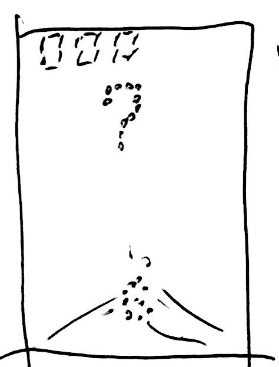

# 画面イメージ

仮タイトル：足すと３

# 操作方法
- 何かキーを押せばゲーム開始
- 0～9の数字キーを押すと、その数字を発射

# ターゲットデバイス(PC or スマホ)
- PCのWebGL

# （あれば）ゲームのストーリーや世界観
- 特になし

# ルール(ゲームオーバーの条件や、クリアの条件、得点の仕方、何を競うのか)
- 上から0～9の数字が降ってくる
- 0～9の数字キーを押すと、その数字を発射できる
- 降ってくる数字と発射した数字を足して、1桁目が3になれば、数字が消える
- 降ってくる数字が、画面下のラインに到達するとゲームオーバー
- 正解を続けて、高得点を狙いましょう！

# 利用したアセットや素材の著作者、URL、利用条件
- いらすとや. https://www.irasutoya.com/
  - 何ができるのか？何はできないのか？使う上で必要な条件
  - 非商用利用なら、点数に関わらず、利用可能
  - ただし、以下は禁止
    - 公序良俗に反する目的での利用
    - 素材のイメージを損なうような利用
    - 素材自体をコンテンツ・商品として再配布・販売
    - （LINEクリエイターズスタンプ等も含みます）
    - その他著作者が不適切と判断した場合
  - 上記をクリアしていれば特になし
